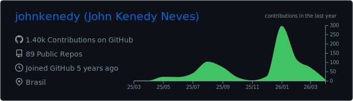
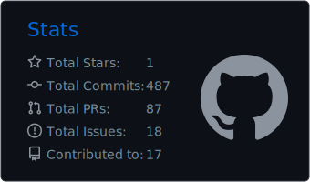

### Hey, I'm John Kenedy !!

### I'm an **MOBILE SOFTWARE ENGINEER**, passionate about **Learning**.

---

## 🚀 Currently Focusing On

- **Compose & Architecture** (Building scalable UI)
- **Kotlin Multiplatform** (Expanding to iOS/Web)
- **Norwegian Language** (Level A2 and climbing! 🇳🇴)

---

## ✨ Professional Highlights

- **5+ years** of professional Android development experience.
- **Mobile Engineer at TQI/PagBank**, focusing on Fintech ecosystems.
- **Multilingual**: English (C1), Portuguese (Native), Norwegian (A2).
- Experienced in high-scale apps like **Itaú** and **PagBank**.

---

## 📊 GitHub Activity & Stats

<picture>
  <source media="(prefers-color-scheme: dark)" srcset="https://raw.githubusercontent.com/johnkenedy/johnkenedy/output/github-contribution-grid-snake-dark.svg">
  
</picture>

  
  
  

---

## 🧰 My Toolbox

**Languages & Frameworks** 

**Tools & Environment** 

---

## 📬 Reach Me

  
  
  
  

  

